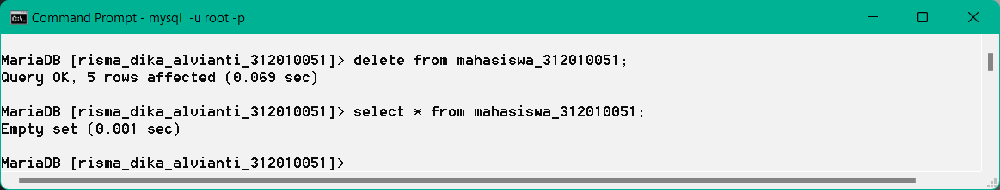
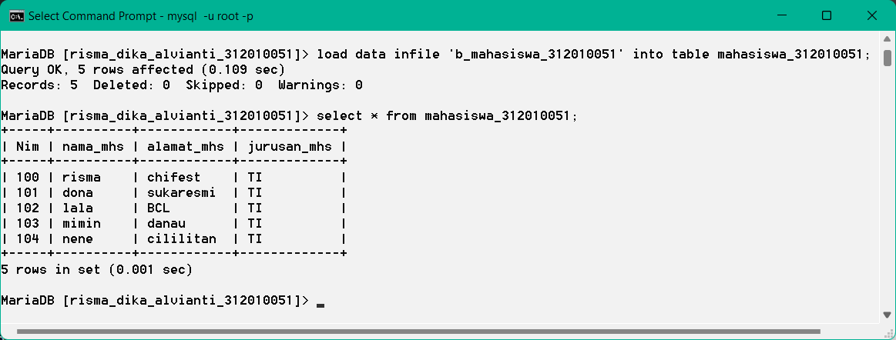

# TUGAS 6
* Nama      : Risma Diki
* Nim       : 312010051
* kelas     : TI.20.D1
* Matkul    : Sistem Basis Data

# Soal
1. masuk ke database nama nim
2. lakukan proses backup dan recovery dengan sql
3. lakukan proses backup dan recovery dengan sqldump
4. tuliskan script cron job untuk melakukan backup otomatis setiap hari minggu jam 12 malam

# jawaban
1. masuk ke database risma_dika_alvianti_312010069

2. lakukan proses backup dan recovery dengan sql

* proses backup :

* data backup terdapat pada file c:\xampp/mysql\data\risma_dika_alvianti_312010051
!

* proses recovery :

* hapus tabel dan mencoba menampilkan tabel : 

* kemudian hapus tabel dan dicoba lagi menampilakn tabel :

3. lakukan proses backup dan recovery dengan sqldump

* proses backup :

* proses recovery :

